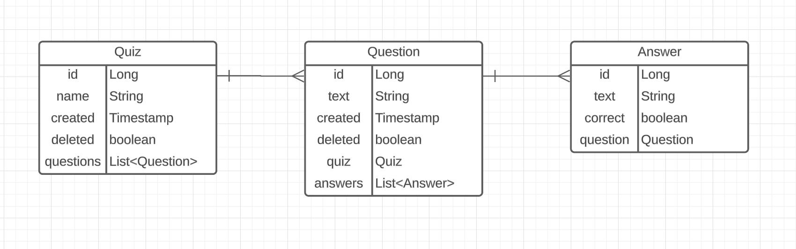

# Quiz API

## Overview

In this assignment students are tasked with creating a small RESTful API that simulates basic backend functionality for a quiz application. Students are given a skeleton that has the `GET quiz` endpoint completely implemented as well as the infrastructure required for it to function. This will allow students to focus solely on completing the other 6 endpoints listed in the [Endpoint Documentation](#endpoint-documentation) below. Student's should start by looking through the provided skeleton and running the app to see what it does.

## Summary of the API

This Quiz API contains 3 entities: `Quiz`, `Question`, and `Answer`. Each have an auto-generated numerical primary key. The `Quiz` entity has a name and maintains a collection of `Question` entities that are part of the the `Quiz` using an `@OneToMany` annotation, provided by JPA, to denote the relationship between the two tables in the database. The `Question` entity has a text field, the `Quiz` that it belongs to annotated with `@ManyToOne` representing the opposite side of the relationship stored in the `Quiz` class, and a collection of `Answer` objects annotated with `@OneToMany`. Finally, the `Answer` entity also has a text field, a boolean to denote if the given `Answer` is the correct one for the `Question` it belongs to, and the `Question` object that it belongs to annotated with `@ManyToOne`.

An entity relationship diagram is provided below that represents the database used by the Quiz API:


A data transfer object representing the basic response for each entity type is provided in the skeleton. Notice that the DTOs are slightly different than the entities. This is intentional and is done in order to avoid infinite recursion when serializing to JSON. The student will need to add more DTOs and when they do will also need to add more functionality to their mapper interfaces. (HINT: you will at the minimum need to add a QuizRequestDto)

---

## Data Transfer Objects

This section describes all the required data transfer objects. Some of them are already provided in the skeleton, but some will need to be created in order to successfully implement the remaining endpoints. All the objects described in this section are listed in JSON format. The types correspond to JSON types and not the Java types you will use in your code. The skeleton already has the entities and response DTO objects created, so you can use them as a reference for how to map the JSON types.

### QuizResponseDto

A quiz response from the API. This object represents the data that will be returned to a user from various endpoints. The `name` must be unique. The `created` timestamp should be assigned when the quiz is created in the database, and must never be updated.

``` json
{ // QuizResponseDto
    "id": "Number",
    "name": "String",
    "created": "String",
    "questions": [{ // QuestionResponseDto
        "id": "Number",
        "text": "String",
        "created": "String",
        "answers": [{ // AnswerResponseDto
            "id": "Number",
            "text": "String"
        }]
    }]
}
```

### QuestionResponseDto

A question response from the API. This object represents a question stored in the database. It will most often be returned nested inside a QuizResponseDto. The `created` timestamp should be assigned when the question is created in the database, and must never be updated.

``` json
{ // QuestionResponseDto
    "id": "Number",
    "text": "String",
    "created": "String",
    "answers": [{ // AnswerResponseDto
        "id": "Number",
        "text": "String"
    }]
}
```

### AnswerResponseDto

An answer response from the API. This object represents an answer stored in the database. It will most often be returned nested inside a QuestionResponseDto. The `created` timestamp should be assigned when the question is created in the database, and must never be updated.

``` json
{ // AnswerResponseDto
    "id": "Number",
    "text": "String"
}
```

#### QuizRequestDto

The QuizRequestDto is used to create a new quiz with associated questions and answers.

```json
{
    "name": "String",
    "questions": [{
        "text": "String",
        "answers": [{
            "text": "String",
            "correct": "boolean"
        }]
    }]
}
```

#### QuestionRequestDto

The QuestionRequestDto is used to add a new question to an existing quiz.

``` json
{
    "text": "String",
    "answers": [{
        "text": "String",
        "correct": "boolean"
    }]
}
```

#### AnswerRequestDto

The AnswerRequestDto is used to add an answer option for a question.

``` json
{
    "text": "String",
    "correct": "boolean"
}
```

## Endpoint Documentation

The focus of this assignment is on creating endpoints and implementing their functionality in the provided Controller, Service, and Repositories. Note that there is a repository for each table in the database, but there is only 1 controller and 1 service which should handle all the endpoints below. The `Get /quiz` endpoint is implemented for you as an example for you to follow while implementing the other 6.

### `GET quiz`

Returns a list of all `Quiz` objects in the database. Each `Quiz` object will contain its associated `Question` objects and each of those `Question` will contain its associated `Answer` objects. `Quiz` and `Question` objects that are "deleted" should not be included in the response.

#### Response

``` Java
['QuizResponseDto']
```

### `POST quiz`

Creates a new `Quiz`. If any required fields are missing or the `name` provided is already taken, an error should be sent in lieu of a response. This endpoint should create the new `Quiz` in the database as well as any nested `Question` and `Answer` objects. The `Question` objects need to be correctly associated with the `Quiz` created and the `Answer` objects should be correctly associated with their `Question`. This means that the foreign keys saved in the database need to point to the correct primary keys. If a `Quiz` with the provided name already exists, but is "deleted", then re-activate the `Quiz` by setting its "deleted" boolean to false and save the new nested `Question` and `Answer` objects to the `Quiz`.

#### Request

``` Java
'QuizRequestDto'
```

#### Response

``` Java
'QuizResponseDto'
```

### `DELETE quiz/{name}`

"Deletes" a `Quiz` with the given name. If no such `Quiz` exists or the `Quiz` is already "deleted", an error should be sent in lieu of a response. This endpoint should also "delete" all `Question` objects associated with the `Quiz` to be "deleted". If a `Quiz` is successfully "deleted", the response should contain the `Quiz` data prior to deletion.

**IMPORTANT:** This action should not actually drop any records from the database! Instead, use the "deleted" boolean to keep track of whether or not a `Quiz` or `Question` has been deleted.

#### Response

``` Java
'QuizResponseDto'
```

### `PATCH quiz/{name}/rename/{newName}`

Updates the name of a `Quiz` with the given name. If no such `Quiz` exists or the `Quiz` is "deleted", an error should be sent in lieu of a response. In the case of a successful update, the returned `QuizResponseDto` should contain the updated name.

#### Response

``` Java
'QuizResponseDto'
```

### `GET quiz/{name}/random`

Returns a random `Question` from the specified `Quiz`. This endpoint should randomly select a `Question` on the `Quiz` with the provided name and return the selected `Question`. "Deleted" `Question` objects should *not* be selected by this endpoint. If a `Quiz` has no `Question` objects associated with it, all of its `Question` objects are "deleted", or the `Quiz` itself is "deleted", then an error should be sent in lieu of a response.

#### Response

``` Java
'QuestionResponseDto'
```

### `PATCH quiz/{name}/add`

Adds a `Question` to the `Quiz` with the provided name. If the `Quiz` does not exist or has been "deleted", an error should be sent in lieu of a response.

#### Request

``` Java
'QuestionRequestDto'
```

#### Response

``` Java
'QuizResponseDto'
```

### `DELETE quiz/{name}/delete/{questionID}`

"Deletes" the `Question` with the provided questionID from the `Quiz` with the provided name. If the `Question` or `Quiz` are already deleted, an error should be sent in lieu of a response.

**IMPORTANT:** This action should not actually drop any records from the database! Instead, use the "deleted" boolean to keep track of whether or not a `Question` has been deleted.

#### Response

``` Java
'QuestionResponseDto'
```
