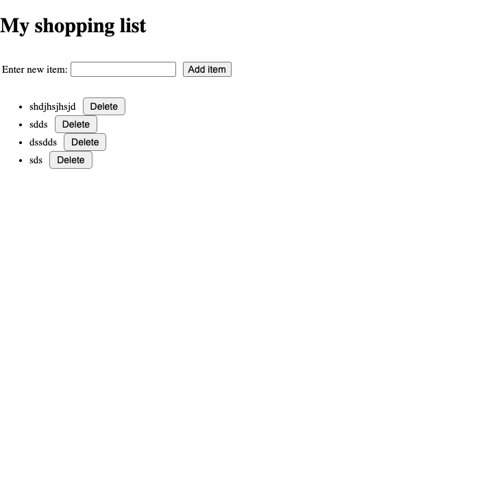

# Simple Shopping List

A basic web-based shopping list built with **HTML**, **CSS**, and **JavaScript**. Users can add and delete items dynamically. It's lightweight, interactive, and requires no backend.

#### User Interface  


## Features

- Add new items to the shopping list
- Delete items with a single click
- Prevents adding empty entries
- Clean and minimal UI with basic styling
- Fully functional with vanilla JavaScript

## How to Run

1. Clone or download this repository.
2. Open the `index.html` file in any modern web browser.

```bash
git clone https://github.com/yourusername/dom-manipulation.git
cd simple-shopping-list # open index.html
```

```
dom-manipulation/
  ├── index.html   # Main HTML file defining layout
  ├── style.css    # CSS file for styling
  ├── script.js    # JavaScript file containing logic
  ├── readme.md    # File containing project description

```