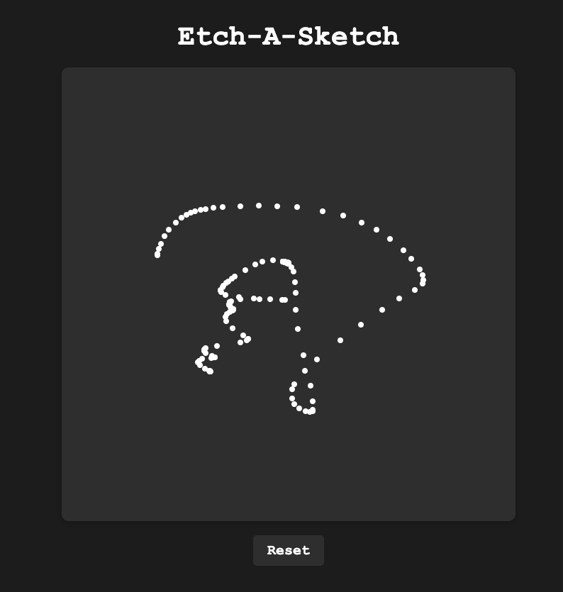

# Etch-A-Sketch

A simple interactive **Etch-A-Sketch** style drawing app built with **HTML**, **CSS**, and **JavaScript**.  
Draw by clicking and dragging inside the canvas area, and reset anytime with the button below.

#### User Interface  


## Features

- Draw white dots by clicking and dragging inside the canvas  
- Smooth drawing experience using mouse events (`mousedown`, `mousemove`, `mouseup`, etc.)  
- Reset button clears the entire drawing instantly  
- Dark-themed, centered layout with responsive container  
- Prevents dots from drawing outside the container bounds

## How to Run

1. Clone or download this repository.  
2. Open the `index.html` file in any modern web browser.

```bash
git clone https://github.com/yourusername/etch-a-sketch.git
cd etch-a-sketch # open index.html in your browser
```

```
etch-a-sketch/
  ├── index.html    # Main HTML layout
  ├── style.css     # CSS for styling the app
  ├── script.js     # JavaScript logic for drawing and reset
  ├── README.md     # This project description file
```
