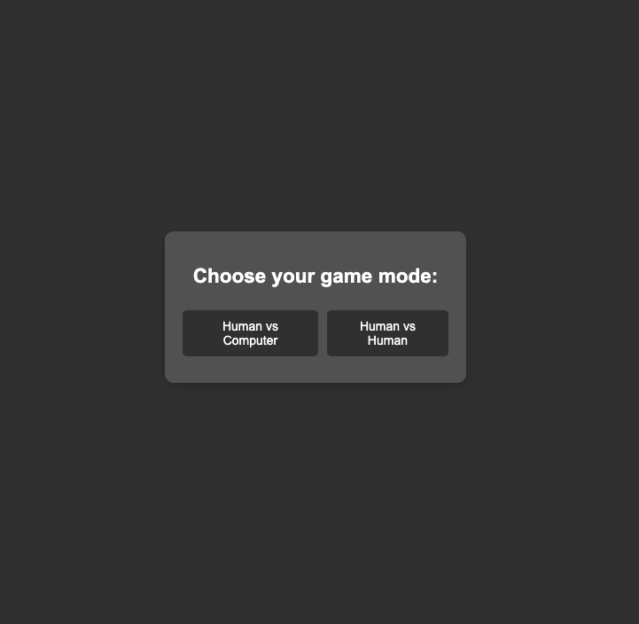

# Rock Paper Scissors

A simple interactive **Rock Paper Scissors** game built with **HTML**, **CSS**, and **JavaScript**.  
Supports two game modes: **Human vs Computer** and **Human vs Human**.

#### User Interface  


## Features

- Choose between Human vs Computer or Human vs Human modes
- Interactive buttons for Rock, Paper, and Scissors choices
- Shows the game result with colored messages (win, lose, tie)
- Responsive design with clean, minimal styling
- Easy to use with immediate feedback on each round

## How to Run

1. Clone or download this repository.
2. Open the `index.html` file in any modern web browser.

```bash
git clone https://github.com/yourusername/rock-paper-scissors.git
cd rock-paper-scissors # open index.html
```

```
rock-paper-scissors/
  ├── index.html   # Main HTML layout
  ├── style.css    # CSS for styling the game
  ├── script.js    # JavaScript logic handling gameplay
  ├── readme.md    # File containing project description
```
