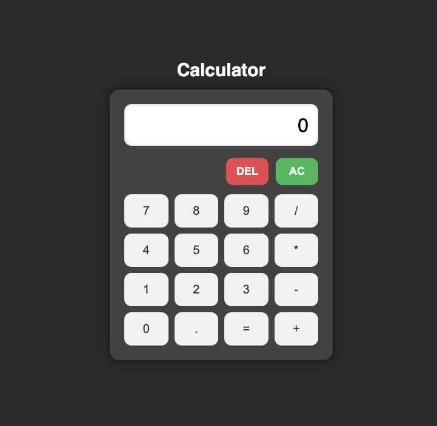

# Simple Calculator

A basic web-based calculator built with **HTML**, **CSS**, and **JavaScript**. It performs standard arithmetic operations: addition, subtraction, multiplication, and division. It also includes features like decimal input, clear (`AC`), delete (`DEL`), and keyboard support.

#### User interface



## Features

- Clickable buttons for numbers and operators
- Decimal point handling
- Backspace (`DEL`) support
- Clear (`AC`) button to reset the calculator
- Keyboard input support (e.g. type `1 + 2 =`)
- Basic error handling (e.g. division by zero)

## How to Run

1. Clone or download this repository.
2. Open the `index.html` file in any modern web browser.

```bash
git clone https://github.com/yourusername/simple-calculator.git
cd simple-calculator # open index.html
```

#### File Structure
```
simple-calculator/
  ├── index.html   # Main HTML file defining the calculator layout
  ├── styles.css   # CSS file for styling and layout
  ├── script.js    # JavaScript file containing calculator logic
  ├── readme.md    # File containing project description

```