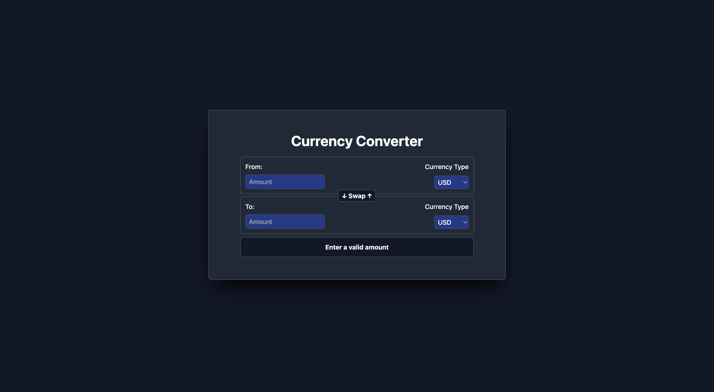

# Currency Converter  

A React web application that allows users to convert one currency to another using real-time exchange rates fetched from a reliable API.  

## Features  
- **Real-Time Conversion**: Fetch live exchange rates to provide accurate currency conversion.  
- **Currency Swapping**: Easily swap the "From" and "To" currencies with a single click.  
- **Dynamic Dropdowns**: Select from a wide range of currencies for conversion.  
- **User-Friendly Interface**: Simple and intuitive design for seamless currency conversion.  

## Technologies Used  
- **React**: A modern JavaScript library for building user interfaces.  
- **CSS**: For styling and enhancing the app's visual appeal.  
- **RESTful API**: For fetching real-time currency conversion rates.

## Screenshots

- **Image 1:**

- **Image 2:**  

