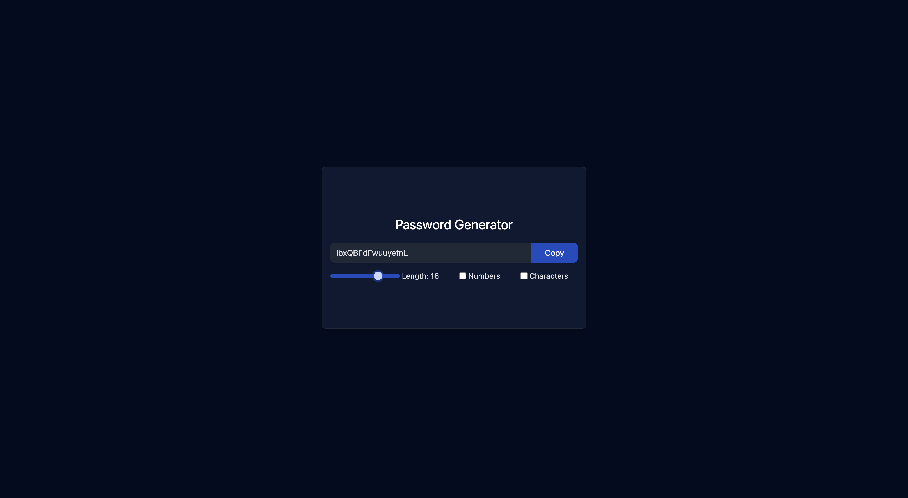

# Password Generator  

A React web application that allows users to generate secure, random passwords based on specified criteria and copy them to the clipboard with a single click.  

## Features  
- **Customizable Password Generation**:  
  - Specify the desired password length.  
  - Include or exclude numbers, special characters, uppercase, and lowercase letters.  
- **Clipboard Copy**: Easily copy the generated password to the clipboard with the press of a button.  
- **User-Friendly Interface**: A clean and simple design for quick and effortless password creation.  

## Technologies Used  
- **React**: A modern JavaScript library for building user interfaces.  
- **CSS**: For styling and enhancing the app's visual appeal. 

## Screenshots

- **Image 1:**

- **Image 2:**  

- **Image 3:**  

- **Image 4:**  

