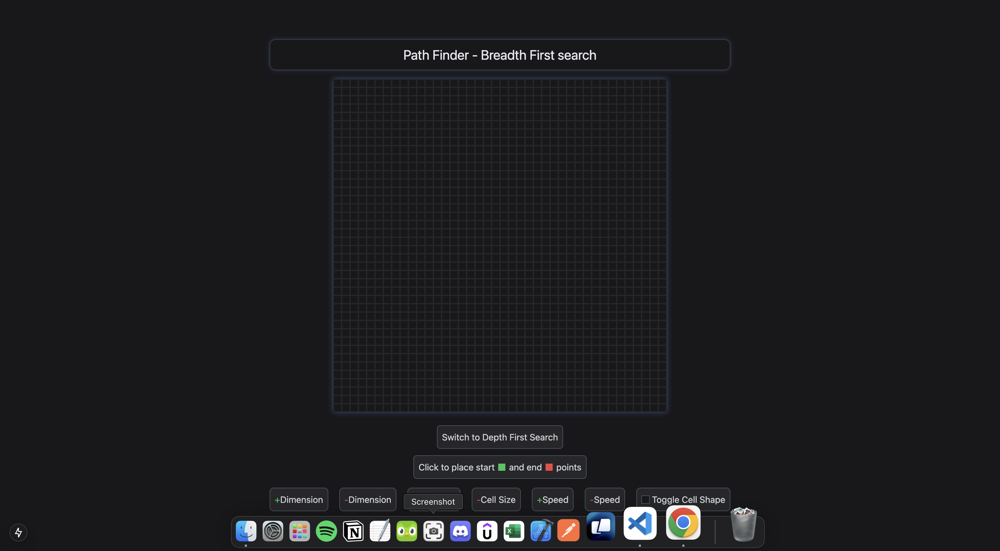
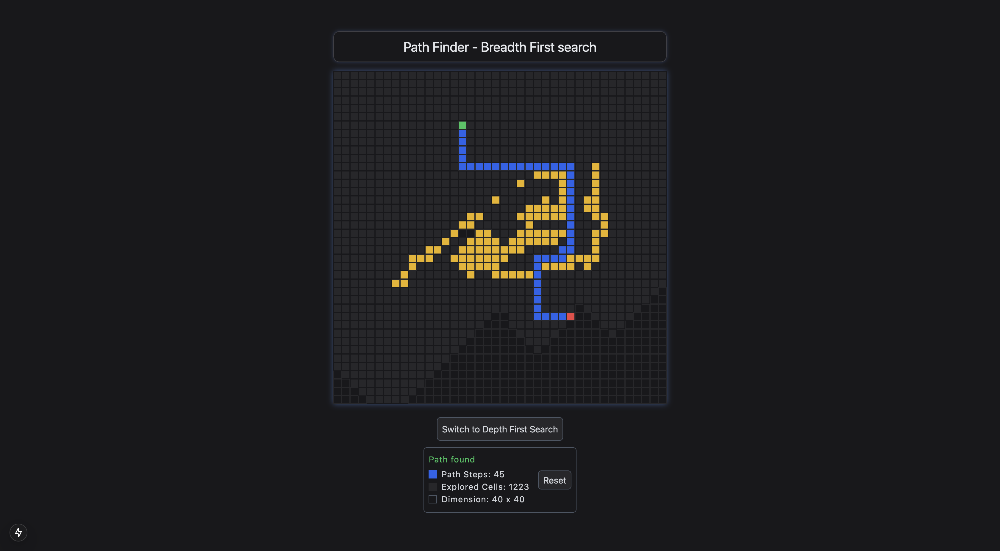
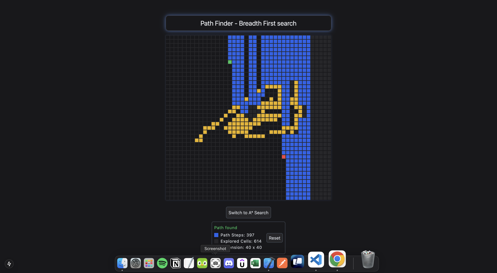
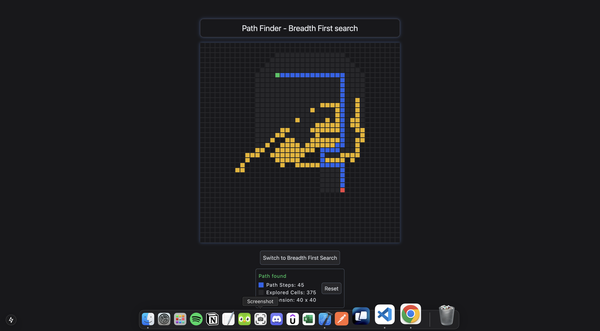

# Path Finder - Algorithms Visualization

Path Finder is an interactive React-based web application that visualizes the behavior of pathfinding algorithms, including Breadth-First Search (BFS), A Star Search, and Depth-First Search (DFS)*. The tool enables users to dynamically create grids, place obstacles, and set start and end points, offering a visual representation of the algorithm's step-by-step process to find a path.

## Features

- **Interactive Grid**: Customize the grid dimensions, cell size, and cell shape to suit different scenarios.
- **Obstacle Placement**: Simulate real-world pathfinding challenges by placing obstacles within the grid.
- **Dynamic Start/End Points**: Select the start and end points for visualizing the pathfinding process.
- **Real-Time Path Display**: Watch the algorithm find a path step-by-step with animations.
- **User Alerts**: Receive notifications indicating whether a path was found or not.
- **Responsive User Interface**: Seamlessly toggle between obstacle placement and start/end point selection modes.

## Technologies

This project utilizes the following technologies:

- **TypeScript**: For static type checking and enhanced code quality.
- **React.js**: A powerful JavaScript library for building user interfaces.
- **Next.js**: A React framework for building server-side rendered applications.
- **Tailwind CSS**: A utility-first CSS framework for responsive, modern UI design.
- **React Hook Form**: A library for managing form state with minimal re-renders.
- **React Context API**: A state management system for efficient component communication.

#### How to Use

1. Start the development server: `npm run dev`
2. Navigate to the application in your browser: `http://localhost:3000`
3. Customize the grid, place obstacles, and set start and end points.
4. Place the start and end point on the grid to initiate the BFS algorithm.
5. Watch the visualization of the path being found in real-time.

#### Future Improvements

This project has several opportunities for enhancement:

- **Obstacle Removal**: Add the functionality to remove obstacles after placement.
- **Additional Algorithms**: Implement more pathfinding algorithms, such as Dijkstra’s Algorithm.
- **Enhanced User Interactions**: Introduce more options for customizing the visualization and grid behavior.
- **Performance Optimization**: Work on improving the visualization speed for larger grids.
- **Path and Visited Cells Visualization**: Display not only the final path but also the visited cells during the search.
- **Stack Overflow Prevention**: Address potential issues with large grids to prevent stack overflow errors.

#### Screenshots

